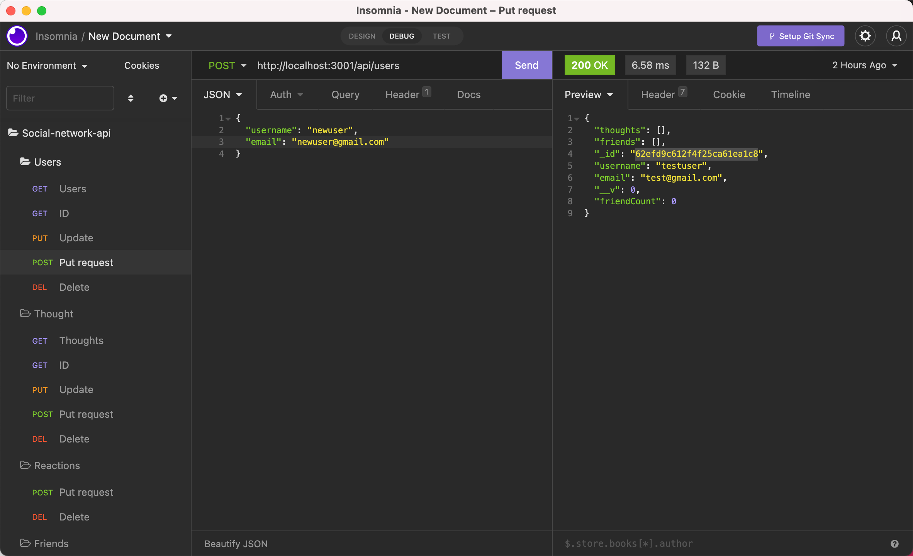

# Social Network API

   

- [Social Network API](#social-network-api)
  - [User Story](#user-story)
  - [Description](#description)
  - [Installation](#installation)
  - [License](#license)
  - [GitHub Repo](#github-repo)
  - [Link to walkthrough video](#link-to-walkthrough-video)
  - [Questions](#questions)

## User Story
    AS A social media startup
    I WANT an API for my social network that uses a NoSQL database
    SO THAT my website can handle large amounts of unstructured data

  ## Description
    GIVEN a social network API
    WHEN I enter the command to invoke the application
    THEN my server is started and the Mongoose models are synced to the MongoDB database
    WHEN I open API GET routes in Insomnia for users and thoughts
    THEN the data for each of these routes is displayed in a formatted JSON
    WHEN I test API POST, PUT, and DELETE routes in Insomnia
    THEN I am able to successfully create, update, and delete users and thoughts in my database
    WHEN I test API POST and DELETE routes in Insomnia
    THEN I am able to successfully create and delete reactions to thoughts and add and remove friends to a user’s friend list

    
  ## Installation
    -Clone the repo
    -Install node.js: https://coding-boot-camp.github.io/full-stack/nodejs/how-to-install-nodejs
    -Then in the integrated terminal for the cloned repo terminal:
      -npm install i
      -npm start

  ## License
      
   

      This project is coverted under the MIT License

  ## GitHub Repo
    https://github.com/jleitz27/social-network-api  

  ## Link to walkthrough video
  https://www.screencast.com/t/eoidrsbkpr 

  
  

  ## Questions

  If you have any additional questions please contact me:  
      - GitHub: jleitz27  (https://github.com/jleitz27)
      - Email:  jkleitz27@gmail.com